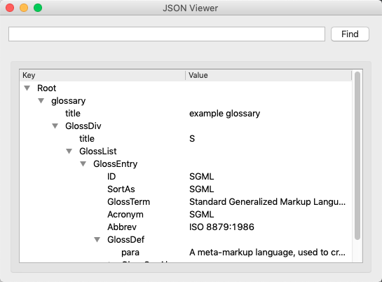

# JSON Viewer

This is a fork from https://github.com/ashwin/json-viewer
I add capabilities to read from standard input and also create the pip installer.



Python3 script to view a JSON file as a tree in GUI.

Invoke as:

```
$ ./json_viewer sample.json
```

Install using pip with:

```
$ pip install json_viewer
```

Sample usage

```
$ python json_viewer sample.json
$ json_viewer sample.json
```

Or you can also read from stdin

```
$ cat sample.json | python json_viewer
$ cat sample.json | json_viewer
```

